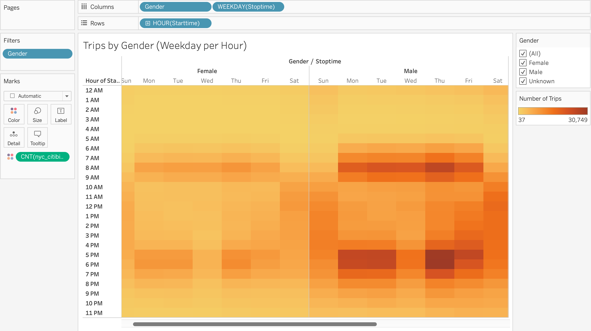

# BIKE SHARING

NY Citibike with Tableau

## Overview of the Statistical Analysis

After a trip to NYC and using citibikes there, a data analyst creates a proposal to start a similar bike business in Des Moines. The project focusses on learning how the bike share business works in NYC by reviewing Citibike data in August 2019. The results will then be shared with potential investors in Des Moines. Tableau is used to create visualizations of the below tasks:
- Determine the total trips taken in August 2019.
- Find the proportion of short term customers to annual subscribers.
- Determine the peak usage hours for the month of August.
- Find the top starting and ending locations.
- Determine the gender breakdown of active riders.
- Find the average duration of a bike ride, by age.
- Determine bike utilization and bikes due for repair.
- Determine the length of time that bikes are checked out for all riders and genders.
- Find the number of bike trips for all riders and genders for each hour of each day of the week.
- Find the number of bike trips for each type of user and gender for each day of the week.

## Results

#### Link to Tableau Story

#### Cleaning the data

Jupyter Notebook is used to convert the trip duration data to datetime type. 
<table>
 <tr>
   <td></td>
  <td></td>
 </tr>
</table>

#### Visualizations explained

1. With a total of 2,344,224 trips in August 2019, there is much data to visualize. 
- As per the image below, 80% of the users are Subscribers, who make regular use of the bikes and are a predictable source of income for the program. 
- The data also shows that 65% of total bike users are predominantly males followed by females at 25%. 

2. The [below dashboard](https://public.tableau.com/app/profile/lois2018/viz/Mod14_7/NYCBikeDashB) shows that the peak hours in August are 7AM-10AM and 4PM-8PM. 
- The bike usage is across all ages, however teenagers and youngsters use more. 
- The bike utilization visual shows the amount of time each bike is used in August 2019. A reminder plan can be established when a bike is ready for servicing.

3. [Bike repair and non-peak hours](https://public.tableau.com/app/profile/lois2018/viz/Mod14_6/BikeMaintenance):
- The dashboard shows the frequency of bike usage for each bike and non peak hours. 
- The red tiles show bikes used heavily and will require regular repair or replacement. The shades of green tiles show low bike usage and will not need repair so often. The divergence line shows that a third of the total bikes are used heavily.
- Using the bike utilization metrics and the number of times a bike is used, bike servicing/replacement can be scheduled during non-peak hours.
- Non-peak hours during August 2019 are from 1AM to 5AM.

4. [Checkout Times for all Users](https://public.tableau.com/app/profile/lois2018/viz/Mod14_1_16681998226970/CheckoutTimesforUsers):

5. [Checkout Times by Gender](https://public.tableau.com/app/profile/lois2018/viz/Mod14_2/CheckoutTimesbyGender): 

6. [Trips on Weekday per Hour](https://public.tableau.com/app/profile/lois2018/viz/Mod14_3_16681999413690/TripsByWeekdayperHour):

7. [Trips by Gender on Weekday per Hour](https://public.tableau.com/app/profile/lois2018/viz/Mod14_4/TripsbyGenderWeekdayperHour):

8. [Trips by Gender and User Type](https://public.tableau.com/app/profile/lois2018/viz/Mod14_5/UserTripsbyGender):
- This visualization is a heatmap that shows the number of bike trips broken down by gender for each day of the week by each Usertype. 
- The darker areas with subscriber user type confirm that there are more subscribers than customers. 
- 72% of the subscribers are males followed by females at 26%. 
- 90% of male users are subcribers and 84% of female users are subscribers.
- 85% of unknown/undeclared gender are customers.

## Summary

#### High-level Summary of the Results

- Just like NYC has more subscribers for bike sharing compared to customers, Des Moines should also push for subscription services.
- Since male subscribers show higher bike usage followed by female subscribers in NYC, Des Moines should also target males as they prefer biking as shown in the current analysis.
- One third of the bikes need repair/service during non peak hours (1AM - 5AM)

 
 
#### Additional Visualizations for Future Analysis:
- There is a need to understand why the dark colored locations in the below visualization are so popular. Are they close to ferries or subways or workplaces? Understanding the nature of these locations is crucial for establishing bike locations in Des Moines. It would also help to look at how far do bikers travel and which stations are most popular. 

- The start and stop locations for bike rides can also be analyzed based on gender. A closer examination of the station locations might provide clarity on why more women aren't using the bike-share program.

- The distance covered in a trip can be studied along with duration and subscription costs to get a better picture of why users prefer bikes compared to other transport.

  
